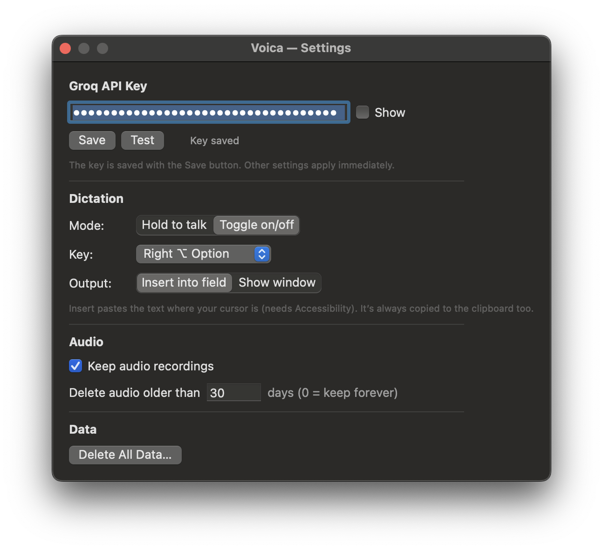

<!-- Languages: [English](README.md) · **Русский** -->

# Voica

Меню-бар приложение для macOS: диктуешь голосом — получаешь текст **с пунктуацией**.
Транскрибация через [Groq](https://groq.com) Whisper (`whisper-large-v3-turbo`).

> Встроенная диктовка iOS/macOS не расставляет знаки препинания. Voica — расставляет.

## Возможности

- **Диктовка по горячей клавише**: PTT (зажал-сказал-отпустил) или Toggle (нажал/нажал).
- Распознанный текст **вставляется в активное поле** (по умолчанию) — или показывается в
  редактируемом окне, на выбор в настройках; в буфер копируется всегда, как фолбэк.
- **История** всех транскрибаций (SQLite) с просмотром, повторным копированием и проигрыванием аудио.
- **Хранение аудио** с авто-удалением (по умолчанию 30 дней, настраивается; текст истории остаётся).
- **Автоопределение языка** распознавания (русский + английские вкрапления).
- **Словарь терминов** — слова, которые Whisper часто коверкает (названия, жаргон,
  англицизмы), подставляются подсказкой в каждую диктовку для точности написания. Опционально
  **ИИ-проход** (Groq LLM) надёжно исправляет термины, которые всё равно исказились, —
  с учётом падежа и контекста.
- **Интерфейс на русском и английском** — по языку системы.
- **Проверка обновлений** — при запуске (по желанию) сверяет версию с GitHub и предлагает
  открыть страницу релиза. Сама ничего не качает и не ставит; можно отключить.
- API-ключ хранится в **защищённом файле** (права `0600`, доступен только вам).

## Скриншоты

<p align="center">
  
  
</p>

## Установка

1. Скачайте `Voica-<версия>.dmg` со страницы [Releases](https://github.com/Inhum/voica/releases)
   (или соберите сами — см. ниже).
2. Откройте `.dmg` и перетащите **Voica** в **Applications**.
3. Первый запуск: приложение не нотаризовано, поэтому macOS предупредит о разработчике.
   System Settings → Privacy & Security → **Open Anyway**. Дальше запускается обычным двойным кликом.

## Первый запуск и разрешения

При первом использовании macOS попросит выдать два разрешения:

- **Микрофон** — для записи (запрос появится при первой диктовке).
- **Accessibility** — для глобальной горячей клавиши:
  System Settings → Privacy & Security → **Accessibility** → включить Voica.

Затем откроется окно настроек — **вставьте Groq API-ключ** (`gsk_…`),
нажмите **Проверить**, затем **Сохранить**. Ключ можно получить на
[console.groq.com/keys](https://console.groq.com/keys).

## Использование

- **PTT** (по умолчанию): зажмите правый ⌥ Option, говорите, отпустите — текст придёт через секунду.
- **Toggle**: одно нажатие выбранной клавиши — старт, второе — стоп.
- Или кликните **Dictate** в меню (ручной старт/стоп, без горячей клавиши).

Иконка в строке меню показывает состояние: покой → запись (пульсирует) → отправка в Groq.

## Где хранятся данные

```
~/Library/Application Support/com.ushakov.voica/history.sqlite   # история
~/Library/Application Support/com.ushakov.voica/audio/           # аудиозаписи
~/Library/Application Support/com.ushakov.voica/credentials      # API-ключ (0600)
~/Library/Preferences/com.ushakov.voica.plist                    # настройки
```

Полная очистка: Settings → **Delete all data** (с подтверждением случайной фразой).

## Сборка из исходников

Нужны только Command Line Tools (`xcode-select --install`), полный Xcode не требуется.

```bash
./scripts/make-cert.sh       # один раз: локальный сертификат для стабильной подписи
./scripts/build.sh           # собирает build/Voica.app (release)
./scripts/run.sh             # сборка + запуск с логами в терминале
./scripts/package.sh         # собирает build/Voica-<версия>.dmg
./build/Voica.app/Contents/MacOS/Voica --test-all   # самотест
```

## Ключ Groq

Voica использует ваш **собственный** ключ Groq (модель BYO-key) — приложение ничей ключ
не раздаёт. Использование Groq API подчиняется [условиям Groq](https://groq.com/terms-of-use).

**Если включаете ИИ-исправление терминов** (Настройки → Словарь), Voica дополнительно
обращается к chat-модели `qwen/qwen3-32b`. Если в вашей организации Groq доступ к моделям
ограничен — разрешите эту модель в console.groq.com → Settings → Limits, иначе исправление
будет молча откатываться к исходному тексту (fail-open по замыслу).

## Благодарности

Voica во многом собрана с помощью [Claude Code](https://claude.com/claude-code) —
агентного инструмента Anthropic — в роли AI-напарника.

## Лицензия

[MIT](LICENSE) © 2026 Ivan Ushakov
