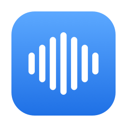
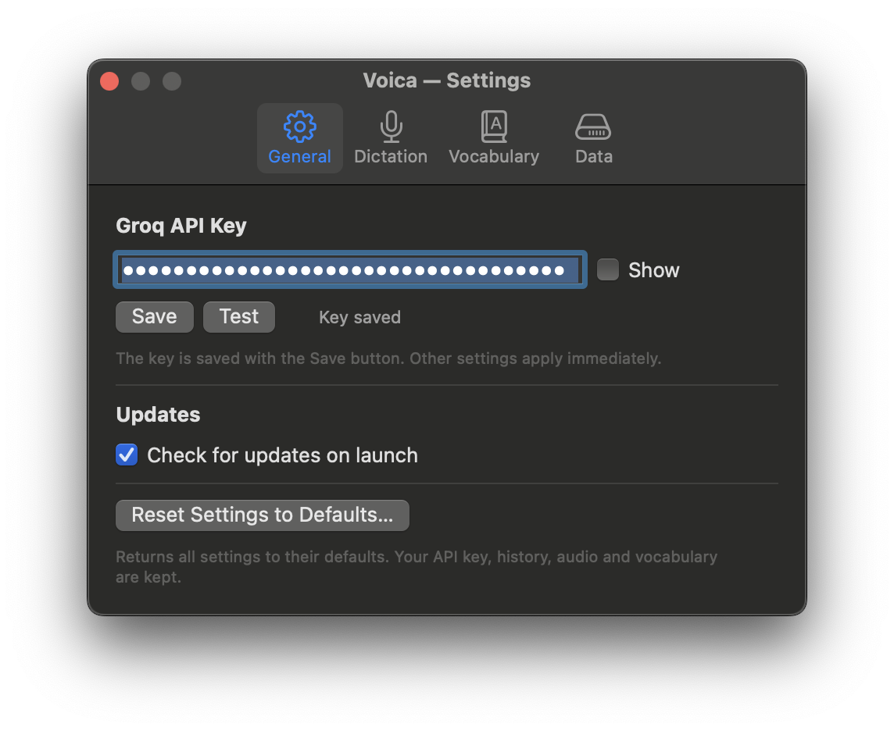
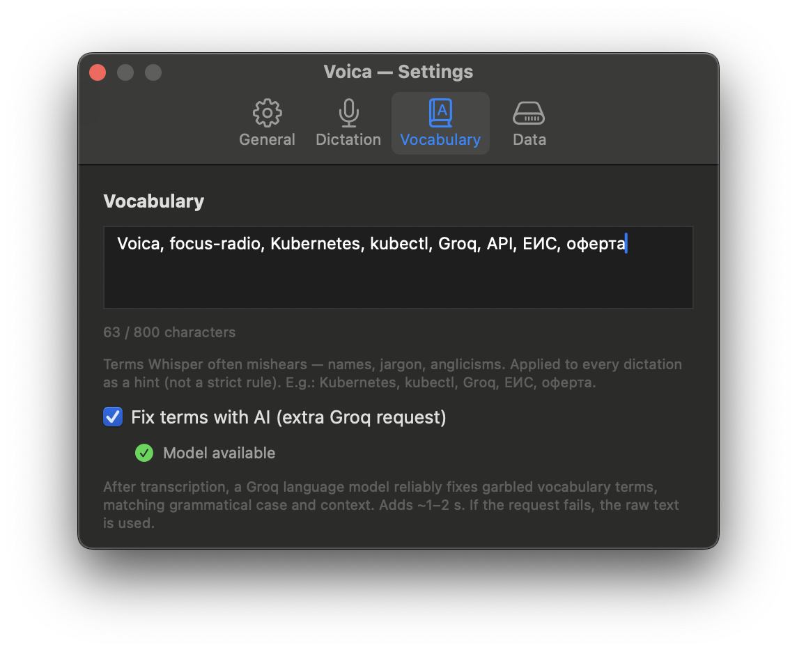
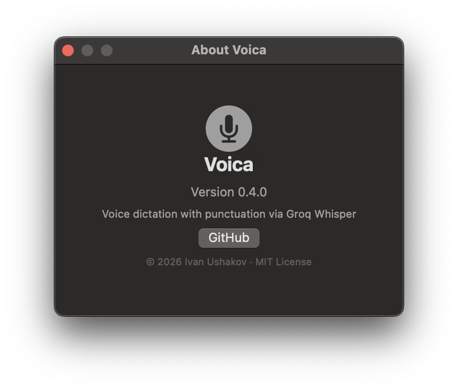

<p align="center"><a href="README.md">English</a> · <b>Русский</b></p>

<p align="center">
  
</p>

<h1 align="center">Voica</h1>

<p align="center">
  Меню-бар приложение для macOS: диктуешь голосом — получаешь текст <b>с пунктуацией</b> —
  через <a href="https://groq.com">Groq</a> Whisper (<code>whisper-large-v3-turbo</code>)
  или полностью офлайн локальной моделью (GigaAM v3).
</p>

<p align="center">
  
  
  
  <a href="https://deepwiki.com/Inhum/voica"></a>
</p>

---

Встроенная диктовка iOS/macOS не расставляет знаки препинания — ни точек, ни запятых,
ни вопросительных знаков. Voica — расставляет: диктуете по горячей клавише и получаете
чистый текст с пунктуацией прямо там, где печатаете. Распознавание — через
[Groq](https://groq.com) Whisper (`whisper-large-v3-turbo`), быстро и дёшево, — или
**полностью офлайн** локальной моделью (GigaAM v3 от Сбера, русский распознаёт отлично),
без интернета и без ключа.

## Возможности

- **Диктовка по горячей клавише**: PTT (зажал-сказал-отпустил) или Toggle (нажал/нажал).
- **Локальный офлайн-движок (по желанию)** — переключите Настройки → Основные на
  «Локально (офлайн)», и распознавание идёт целиком на вашем Маке через Core ML на
  Neural Engine (модель [GigaAM v3](https://github.com/salute-developers/GigaAM) от Сбера,
  MIT; русский распознаёт отлично, пунктуация из коробки). Модель докачивается один раз
  (~400 МБ, с прогрессом) и удаляется в один клик в Настройки → Данные. Если облако
  недоступно — Voica сама переключится на локальную модель и предупредит уведомлением.
  Особенности: английские слова могут записаться кириллицей, словарь-подсказка работает
  только с облаком.
- Распознанный текст **вставляется в активное поле** (по умолчанию) — или показывается в
  редактируемом окне, на выбор в настройках; в буфер копируется всегда, как фолбэк.
- **История** всех транскрибаций (SQLite) с просмотром, повторным копированием и проигрыванием аудио.
- **Хранение аудио** с авто-удалением (по умолчанию 30 дней, настраивается; текст истории остаётся).
- **Автоопределение языка** распознавания (русский + английские вкрапления).
- **Словарь терминов** — слова, которые Whisper часто коверкает (названия, жаргон,
  англицизмы), подставляются подсказкой в каждую диктовку для точности написания. Мягкий
  лимит ~800 символов (Whisper читает только последние ~224 токена подсказки; живой счётчик
  в настройках показывает бюджет). Опционально **ИИ-проход** (Groq LLM) надёжно исправляет
  термины, которые всё равно исказились, — с учётом падежа и контекста.
- **Интерфейс на русском и английском** — по языку системы.
- **Проверка обновлений** — при запуске (по желанию) сверяет версию с GitHub и предлагает
  открыть страницу релиза. Сама ничего не качает и не ставит; можно отключить.
- API-ключ хранится в **защищённом файле** (права `0600`, доступен только вам).
- **Приватность**: всё остаётся на вашем Маке. Аудио уходит только в Groq на распознавание —
  а с локальным движком не уходит вообще никуда.

## Скриншоты

<p align="center">
  
  
  
</p>

## Установка

1. Скачайте `Voica-<версия>.dmg` со страницы [Releases](https://github.com/Inhum/voica/releases)
   (или соберите сами — см. ниже).
2. Откройте `.dmg` и перетащите **Voica** в **Applications**.
3. Приложение не нотаризовано, поэтому первый запуск блокируется окном **«Voica» Not Opened**
   (macOS «не может проверить на вредоносность»). Нажмите **Done** (не «Move to Bin»), откройте
   System Settings → **Privacy & Security**, пролистайте до раздела Security и нажмите
   **Open Anyway** рядом со строкой про Voica; подтвердите ещё раз. Дальше запускается обычным
   двойным кликом. Либо один раз в терминале: `xattr -dr com.apple.quarantine /Applications/Voica.app`.

## Первый запуск и разрешения

При первом использовании macOS попросит выдать два разрешения:

- **Микрофон** — для записи (запрос появится при первой диктовке).
- **Accessibility** — для глобальной горячей клавиши:
  System Settings → Privacy & Security → **Accessibility** → включить Voica.

Затем откроется окно настроек — **вставьте Groq API-ключ** (`gsk_…`),
нажмите **Проверить**, затем **Сохранить**. Ключ можно получить на
[console.groq.com/keys](https://console.groq.com/keys).
Не хотите заводить ключ и слать аудио в облако? Выберите в Настройки → Основные
**«Локально (офлайн)»** — Voica один раз скачает модель (~400 МБ), и ключ не понадобится вовсе.

## Использование

- **PTT** (по умолчанию): зажмите правый ⌥ Option, говорите, отпустите — текст придёт через секунду.
- **Toggle**: одно нажатие выбранной клавиши — старт, второе — стоп.
- Или кликните **Dictate** в меню (ручной старт/стоп, без горячей клавиши).

Иконка в строке меню показывает состояние: покой → запись (пульсирует) → отправка в Groq.

## Где хранятся данные

```
~/Library/Application Support/com.ushakov.voica/history.sqlite   # история
~/Library/Application Support/com.ushakov.voica/audio/           # аудиозаписи
~/Library/Application Support/com.ushakov.voica/credentials      # API-ключ (0600)
~/Library/Application Support/com.ushakov.voica/models/          # локальная модель (если скачана)
~/Library/Preferences/com.ushakov.voica.plist                    # настройки
```

Полная очистка: Settings → **Delete all data** (с подтверждением случайной фразой).

## Сборка из исходников

Нужны только Command Line Tools (`xcode-select --install`), полный Xcode не требуется.

```bash
./scripts/make-cert.sh       # один раз: локальный сертификат для стабильной подписи
./scripts/build.sh           # собирает build/Voica.app (release)
./scripts/run.sh             # сборка + запуск с логами в терминале
./scripts/package.sh         # собирает build/Voica-<версия>.dmg
./build/Voica.app/Contents/MacOS/Voica --test-all   # самотест
```

## Ключ Groq

Ключ нужен только **облачному** движку (и ИИ-исправлению терминов) — локальный работает
без него. Voica использует ваш **собственный** ключ Groq (модель BYO-key) — приложение
ничей ключ не раздаёт. Использование Groq API подчиняется
[условиям Groq](https://groq.com/terms-of-use).

**Если включаете ИИ-исправление терминов** (Настройки → Словарь), Voica дополнительно
обращается к chat-модели `llama-3.3-70b-versatile`. В некоторых организациях Groq chat-модели
по умолчанию заблокированы — если статус показывает «заблокирована», разрешите модель в
console.groq.com → Settings → Limits. Иначе исправление молча откатывается к исходному тексту
(fail-open по замыслу).

## Благодарности

Voica во многом собрана с помощью [Claude Code](https://claude.com/claude-code) —
агентного инструмента Anthropic — в роли AI-напарника.

## Лицензия

[MIT](LICENSE) © 2026 Ivan Ushakov
