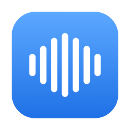
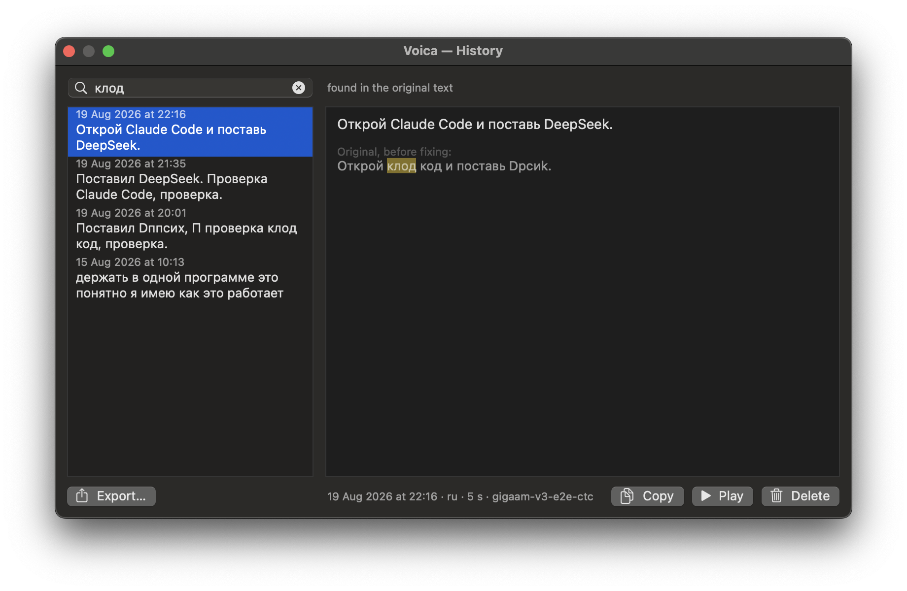
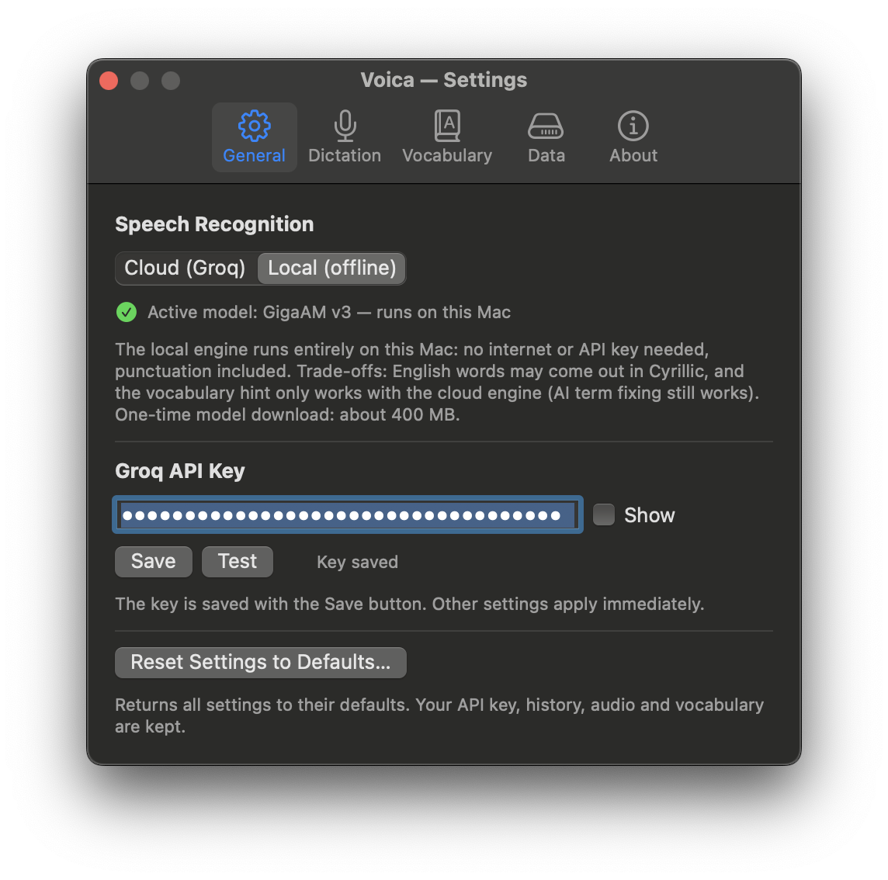
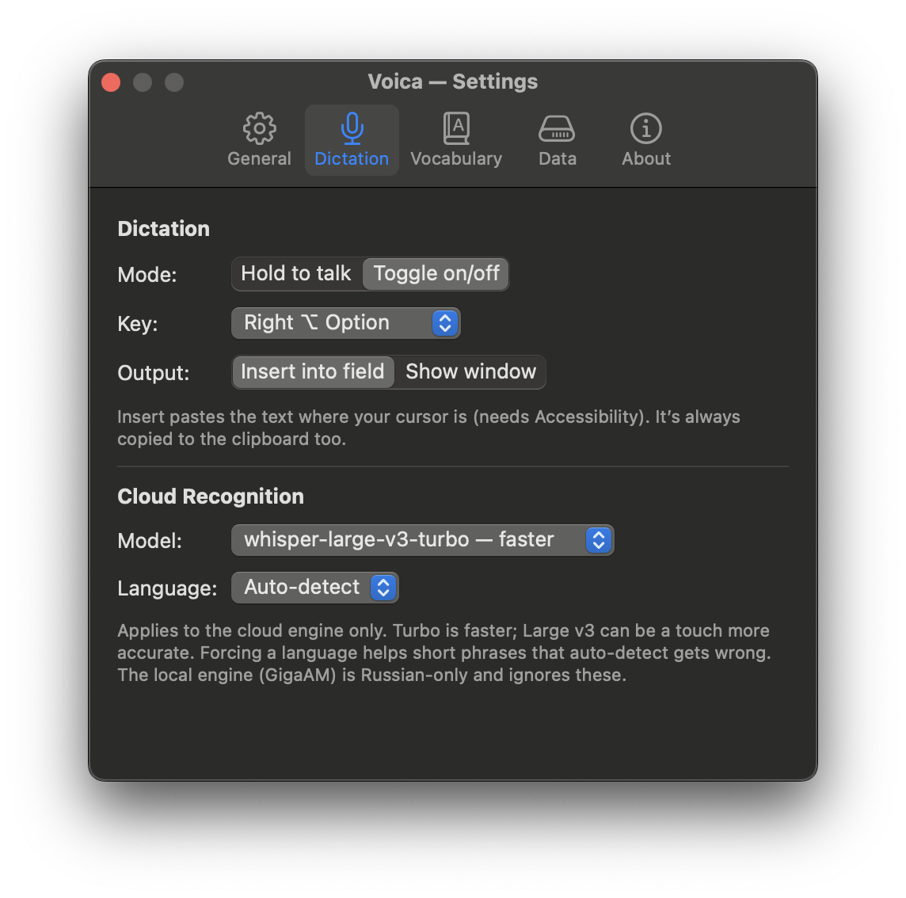
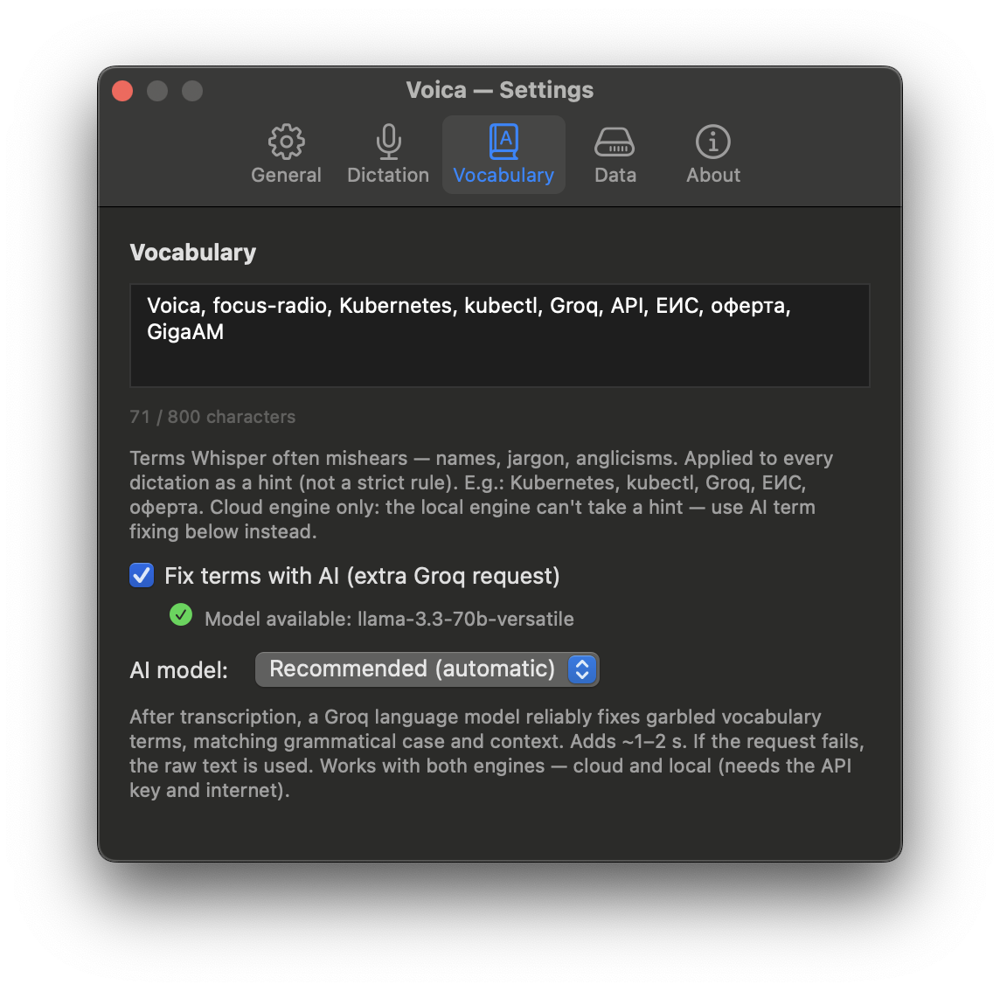
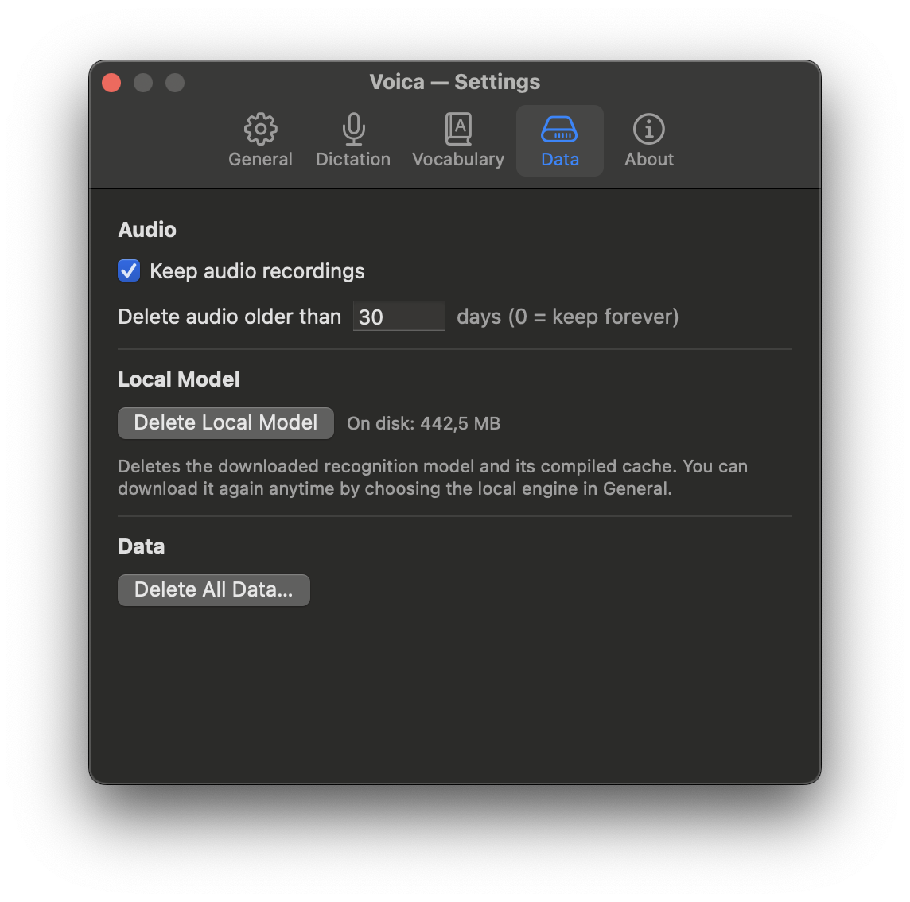
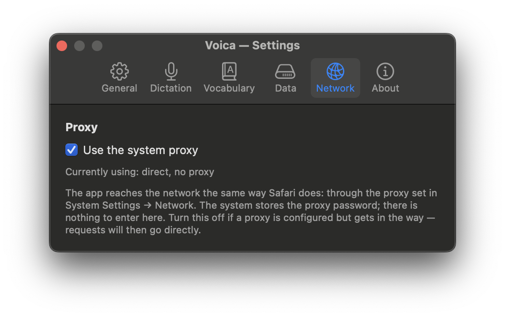
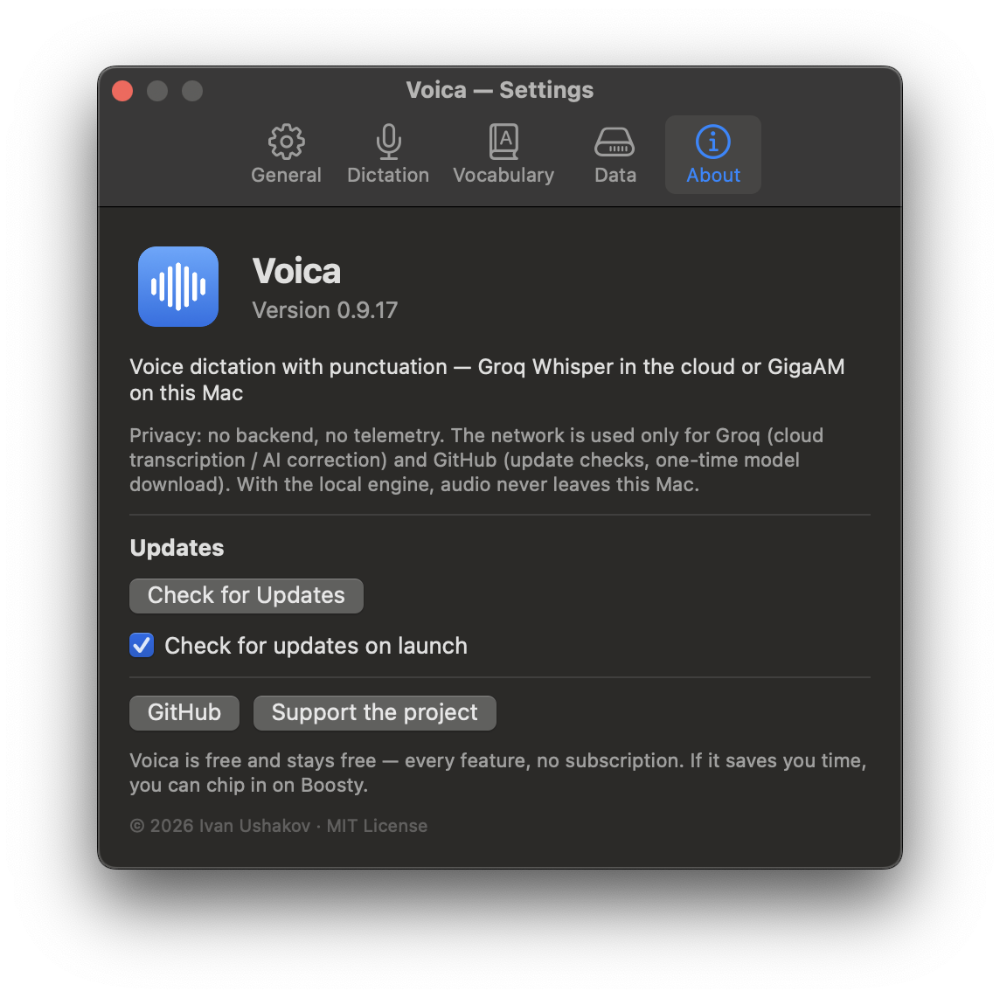

<p align="center"><a href="README.md">English</a> · <b>Русский</b> · <a href="https://github.com/Inhum/voica-win/blob/main/README.ru.md">Версия для Windows →</a></p>

<p align="center">
  
</p>

<h1 align="center">Voica</h1>

<p align="center">
  Меню-бар приложение для macOS: диктуешь голосом — получаешь текст <b>с пунктуацией</b> —
  через <a href="https://groq.com">Groq</a> Whisper (<code>whisper-large-v3-turbo</code>)
  или полностью офлайн локальной моделью (GigaAM v3).
</p>

<p align="center">
  
  
  
  <a href="https://deepwiki.com/Inhum/voica"></a>
  <a href="https://boosty.to/voica"></a>
</p>

---

Встроенная диктовка iOS/macOS не расставляет знаки препинания — ни точек, ни запятых,
ни вопросительных знаков. Voica — расставляет: диктуете по горячей клавише и получаете
чистый текст с пунктуацией прямо там, где печатаете. Распознавание — через
[Groq](https://groq.com) Whisper (`whisper-large-v3-turbo`), быстро и дёшево, — или
**полностью офлайн** локальной моделью (GigaAM v3 от Сбера, русский распознаёт отлично),
без интернета и без ключа.

## Поддержать проект

Voica бесплатна и останется бесплатной — все функции, без подписки. Если она экономит вам
время, поддержать работу можно на [Boosty](https://boosty.to/voica): путь к 1.0 и
[версия для Windows](https://github.com/Inhum/voica-win).

## Возможности

- **Диктовка по горячей клавише**: PTT (зажал-сказал-отпустил) или Toggle (нажал/нажал).
  В режиме Toggle запись **стартует двойным тапом** (одиночное нажатие — стоп), чтобы не
  начать её случайно; отключается в настройках.
- **Плашка записи** внизу экрана, пока идёт диктовка: живая волна и кнопки отмены и стопа, а на
  время распознавания — «Распознаю…». Отмена выбрасывает запись, никуда её не отправляя. Мешает —
  выключите, и роль индикатора вернётся иконке в строке меню.
- **Локальный офлайн-движок (по желанию)** — переключите Настройки → Основные на
  «Локально (офлайн)», и распознавание идёт целиком на вашем Маке через Core ML на
  Neural Engine (модель [GigaAM v3](https://github.com/salute-developers/GigaAM) от Сбера;
  конверсия в Core ML — наша, опубликована как
  [inhum/gigaam-v3-coreml](https://huggingface.co/inhum/gigaam-v3-coreml),
  MIT; русский распознаёт отлично, пунктуация из коробки). Модель докачивается один раз
  (~400 МБ, с прогрессом; загрузку можно отменить) и удаляется в Настройки → Данные —
  с вопросом, сколько места освободится. Если облако недоступно, а модель установлена — Voica
  сама распознает локально и предупредит уведомлением. Обратной подмены нет: **выбрали
  «Локально (офлайн)» — звук не уйдёт в облако ни при каких условиях**. Если модели нет,
  диктовка не начнётся, а Voica скажет, чего не хватает, и куда нажать.
  Особенности: латинские слова могут выйти смесью алфавитов (`Dпсик` вместо `DeepSeek`) —
  это чинит словарь терминов, см. ниже. Подсказка при распознавании остаётся облачной.
- Распознанный текст **вставляется в активное поле** (по умолчанию) — или показывается в
  редактируемом окне, на выбор в настройках; в буфер копируется всегда, как фолбэк.
- **История** всех транскрибаций (SQLite): просмотр, повторное копирование, проигрывание аудио,
  удаление — по одной записи или пачкой, выделив их через Cmd/Shift, — и экспорт всей истории
  в Markdown / CSV / JSON.
- **Поиск по истории** (Cmd+F) — ищет не только по готовому тексту, но и по тому, **что
  услышало распознавание до исправлений**. Вы помните, что сказали, а не то, во что это
  превратилось: продиктовали «клодкод» — найдётся и по нему, и по `Claude Code`. Совпадения
  подсвечиваются, показывается их число в записи.
- **Хранение аудио** с авто-удалением (по умолчанию 30 дней, настраивается; текст истории остаётся).
- **Выбор облачной модели и языка распознавания** (Настройки → Диктовка): Turbo (быстрее) или
  Large v3 (точнее); язык — автоопределение (по умолчанию, русский + английские вкрапления)
  либо форсировать русский/английский для коротких фраз. Локальный движок — русскоязычный.
- **Словарь терминов** — список слов, которые распознавание коверкает (названия, жаргон,
  англицизмы). Работает в три слоя:
  - **Правила, прямо на вашем Маке.** Искажённые написания подтягиваются к словарным без
    ключа, без интернета и на обоих движках. Именно это делает локальный режим по-настоящему
    автономным. Включено по умолчанию; галочка — там же, над тумблером ИИ.
  - **Подсказка при распознавании** — только облако: список уходит в Whisper и влияет на то,
    как он расслышит. Мягкий лимит ~800 символов (модель читает лишь последние ~224 токена;
    счётчик в настройках показывает бюджет), поэтому важные термины держите в конце списка.
  - **ИИ-проход** (Groq LLM), по желанию — разбирает то, что правилам не под силу: согласует
    падеж и узнаёт сильно искажённые термины. Нужны ключ и интернет; если запрос не удался,
    остаётся текст после правил, хуже не станет.

  Подробнее: [Словарь терминов и ИИ-исправление](docs/terms-ai.ru.md).
- **Очистка текста** (Настройки → Диктовка, раздел «Очистка текста»; всё включено по умолчанию
  и выключается по отдельности):
  - **Слова-паразиты** — тянущиеся «э-э-э», «ммм», «хмм» убираются. Правило смотрит на форму
    слова, а не на список написаний, поэтому ловит и те, которых в списке нет. Растянутое
    настоящее слово не удаляется, а распрямляется: «ну-у-у» → «ну». Одиночные «а», «и», «у»,
    «о» — союзы и предлоги, их не трогает никогда. Выключите, если расшифровываете речь дословно.
  - **Кавычки** — прямые заменяются ёлочками по положению в предложении, возвращается пробел
    после двоеточия, а кавычка, оставшаяся без пары, убирается. Английский текст не трогается.
- **Работа через прокси** — если выход в сеть у вас только через прокси, Voica использует
  системные настройки, как Safari; пароль к прокси хранит и спрашивает сама macOS, вводить его
  в Voica не нужно. На вкладке «Сеть» видно, каким путём идут запросы, и есть переключатель,
  если системный прокси наоборот мешает.
- **Интерфейс на русском и английском** — по языку системы.
- **Проверка обновлений** — при запуске (по желанию) сверяет версию с GitHub и предлагает
  открыть страницу релиза. Сама ничего не качает и не ставит; можно отключить.
- API-ключ хранится в **защищённом файле** (права `0600`, доступен только вам).
- **Приватность**: всё остаётся на вашем Маке. Аудио уходит только в Groq на распознавание —
  а с локальным движком не уходит вообще никуда.

## Скриншоты

<p align="center">
  
</p>

<p align="center">
  
  
  
  
  
  
</p>

## Установка

1. Скачайте `Voica-<версия>.dmg` со страницы [Releases](https://github.com/Inhum/voica/releases)
   (или соберите сами — см. ниже).
2. Откройте `.dmg` и перетащите **Voica** в **Applications**.
3. Приложение не нотаризовано, поэтому первый запуск блокируется окном **«Voica» Not Opened**
   (macOS «не может проверить на вредоносность»). Нажмите **Done** (не «Move to Bin»), откройте
   System Settings → **Privacy & Security**, пролистайте до раздела Security и нажмите
   **Open Anyway** рядом со строкой про Voica; подтвердите ещё раз. Дальше запускается обычным
   двойным кликом. Либо один раз в терминале: `xattr -dr com.apple.quarantine /Applications/Voica.app`.

## Первый запуск и разрешения

При первом использовании macOS попросит выдать два разрешения:

- **Микрофон** — для записи (запрос появится при первой диктовке).
- **Accessibility** — для глобальной горячей клавиши:
  System Settings → Privacy & Security → **Accessibility** → включить Voica.

Затем откроется окно настроек — **вставьте Groq API-ключ** (`gsk_…`),
нажмите **Проверить**, затем **Сохранить**. Ключ можно получить на
[console.groq.com/keys](https://console.groq.com/keys).
Не хотите заводить ключ и слать аудио в облако? Выберите в Настройки → Основные
**«Локально (офлайн)»** — Voica один раз скачает модель (~400 МБ), и ключ не понадобится вовсе.

## Использование

- **PTT** (по умолчанию): зажмите правый ⌥ Option, говорите, отпустите — текст придёт через секунду.
- **Toggle**: одно нажатие выбранной клавиши — старт, второе — стоп.
- Или кликните **Dictate** в меню (ручной старт/стоп, без горячей клавиши).

Пока идёт диктовка, внизу экрана видна плашка — живая волна с кнопками отмены и стопа, — а на
время распознавания она сменяется на «Распознаю…». Если плашку выключить, состояние снова
показывает иконка в строке меню: красная пульсирующая на записи, синяя на распознавании.

## Где хранятся данные

```
~/Library/Application Support/com.ushakov.voica/history.sqlite   # история
~/Library/Application Support/com.ushakov.voica/audio/           # аудиозаписи
~/Library/Application Support/com.ushakov.voica/credentials      # API-ключ (0600)
~/Library/Application Support/com.ushakov.voica/models/          # локальная модель (если скачана)
~/Library/Preferences/com.ushakov.voica.plist                    # настройки
```

Полная очистка: Settings → **Delete all data** (с подтверждением случайной фразой). Модель
удаляется отдельно: Settings → **Data** → «Удалить модель».

⚠️ **Удаление самого приложения эти файлы не трогает** — они лежат вне бандла и переживают
и удаление, и переустановку (это сделано намеренно: иначе переустановка стоила бы повторной
выкачки ~400 МБ и всей истории). Если хотите убрать всё, сделайте это **до** удаления
приложения — или удалите каталог `~/Library/Application Support/com.ushakov.voica/` и файл
настроек вручную.

## Сборка из исходников

Нужны только Command Line Tools (`xcode-select --install`), полный Xcode не требуется.

```bash
./scripts/make-cert.sh       # один раз: локальный сертификат для стабильной подписи
./scripts/build.sh           # собирает build/Voica.app (release)
./scripts/run.sh             # сборка + запуск с логами в терминале
./scripts/package.sh         # собирает build/Voica-<версия>.dmg
./build/Voica.app/Contents/MacOS/Voica --test-all   # самотест
```

## Ключ Groq

Ключ нужен только **облачному** движку (и ИИ-исправлению терминов) — локальный работает
без него. Voica использует ваш **собственный** ключ Groq (модель BYO-key) — приложение
ничей ключ не раздаёт. Использование Groq API подчиняется
[условиям Groq](https://groq.com/terms-of-use).

**Если включаете ИИ-исправление терминов** (Настройки → Словарь), Voica дополнительно
обращается к chat-модели Groq. По умолчанию модель выбирается автоматически — лучшая доступная
из вашего живого списка, поэтому если Groq удалит или переименует модель, приложение
само-исцеляется, обновление не нужно. Можно выбрать и конкретную модель. В некоторых
организациях Groq chat-модели по умолчанию заблокированы — если статус показывает
«заблокирована», разрешите выбранную модель в console.groq.com → Settings → Limits. Иначе
исправление молча откатывается к исходному тексту (fail-open по замыслу).

## Благодарности

Voica во многом собрана с помощью [Claude Code](https://claude.com/claude-code) —
агентного инструмента Anthropic — в роли AI-напарника.

## Лицензия

[MIT](LICENSE) © 2026 Ivan Ushakov

Встроенная локальная модель распознавания (GigaAM v3 от Сбера) распространяется под своей
лицензией MIT — см. [THIRD-PARTY-LICENSES.md](THIRD-PARTY-LICENSES.md). Её конверсия в Core ML,
сделанная для Voica, опубликована отдельно:
[inhum/gigaam-v3-coreml](https://huggingface.co/inhum/gigaam-v3-coreml).
